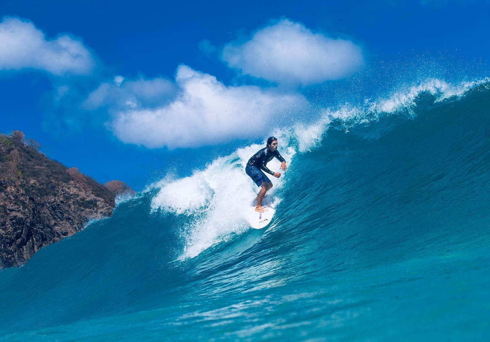

I've reached at that point in life where more than half of it has been dedicated to doing something. For me, that something is surfing. Having started surfing at the age of 14, it's been over 15 years of riding the waves. Ironically, today I find myself far from the ocean, engaging in something else that has also claimed a significant part of my life: research.

In these moments of realization (some call it living in the present), I can see how these two things are alike: research and surfing. Both are activities that demand dedication, discipline, and a certain degree of madness. I could give examples here that only surfers would understand, like navigating through a break, or provide examples that only researchers would grasp, like having a scientific article accepted. But what I mean is that both are activities that have pushed me to practice resilience and have helped me grow as a person.

Another commonality between surfing and research is, at times, the feeling of solitude. It doesn't quite amount to loneliness, but the fact is that much of what you'll experience depends on your efforts, your dedication, and not giving up at the first obstacle.